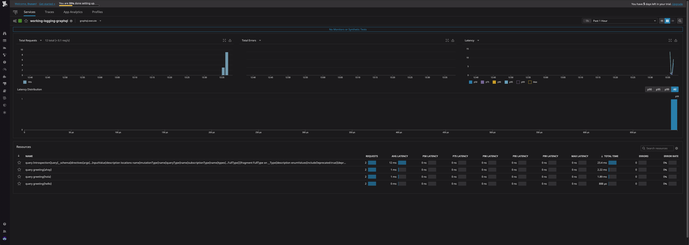
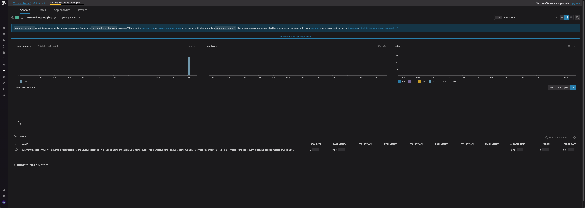

# dd-test

First install dependencies `yarn install`

## Working example
1. `DD_SERVICE_NAME=working-logging yarn start-working`
2. `curl 'http://localhost:4000/' -H 'content-type: application/json' --data-binary '{"operationName":"greeting","variables":{},"query":"query greeting {\n  ahoy\n}\n"}' --compressed`
3. `curl 'http://localhost:4000/' -H 'content-type: application/json' --data-binary '{"operationName":"greeting","variables":{},"query":"query greeting {\n  hello\n}\n"}' --compressed`
4. `curl 'http://localhost:4000/' -H 'content-type: application/json' --data-binary '{"operationName":"greeting","variables":{},"query":"query greeting {\n  hola\n}\n"}' --compressed`
5. open `http://localhost:4000/` in your browser and wait for page to load

### Result

## NOT Working example
1. `DD_SERVICE_NAME=not-working-logging yarn start-not-working`
2. `curl 'http://localhost:4000/' -H 'content-type: application/json' --data-binary '{"operationName":"greeting","variables":{},"query":"query greeting {\n  ahoy\n}\n"}' --compressed`
3. `curl 'http://localhost:4000/' -H 'content-type: application/json' --data-binary '{"operationName":"greeting","variables":{},"query":"query greeting {\n  hello\n}\n"}' --compressed`
4. `curl 'http://localhost:4000/' -H 'content-type: application/json' --data-binary '{"operationName":"greeting","variables":{},"query":"query greeting {\n  hola\n}\n"}' --compressed`
5. open `http://localhost:4000/` in your browser and wait for page to load

### Result
